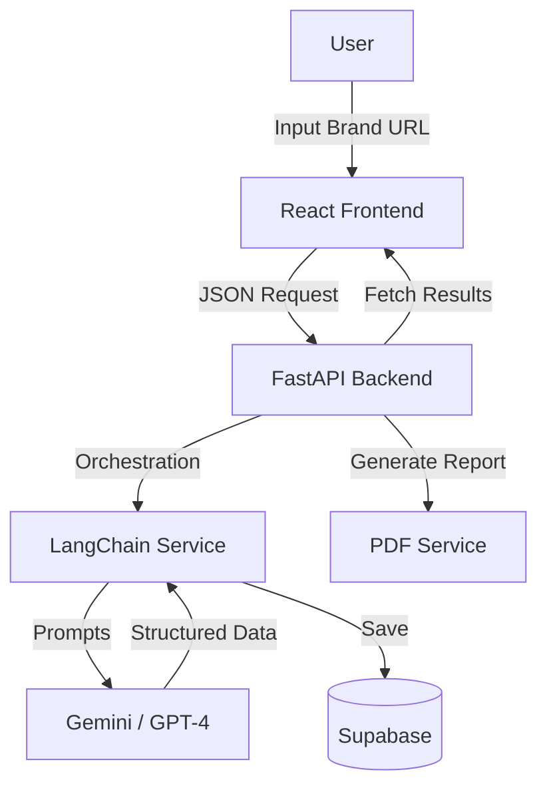

# TG Builder (Target Group Intelligence Engine) 🚀

**TG Builder** is an advanced AI-powered marketing intelligence platform designed to replace the initial 40 hours of work done by human strategists. It automates the generation of listener-centric marketing strategies, hyper-detailed buyer personas, and deployment-ready campaign architectures for Meta and Google Ads.

Built for **"Top 1%" Performance Marketers**, it goes beyond generic AI text generation to produce structured, strategic blueprints that can be directly implemented in ad managers.

---

## 🧠 Core Capabilities

### 1. **Deep Persona Intelligence**

Unlike standard "Customer Avatars," TG Builder conducts a psychological deep-dive into market segments.

- **Psychographics**: Motivations, frustrations, and buying triggers.
- **Digital Index**: Where they hang out online (Platforms, Communities).
- **Funnel Role**: Classifies segments as "Anchors" (Volume drivers) or "Savers" (Efficiency drivers).

### 2. **Professional Campaign Architecture**

Generates platform-specific structures that respect the unique algorithms of each channel:

- **Meta (Facebook/Instagram)**: Uses a **"Cluster-Based"** architecture. Groups interests not just by topic, but by intent (TOF/MOF/BOF), complete with exclusions and demographic layering.
- **Google Ads**: Uses an **"Intent-Based"** architecture. Separates campaigns by Search (Exact/Phrase Match Keywords) and Demand Gen (Audience Signals/In-Market Segments).

### 3. **Consultant-Grade "Playbook" Exports**

One-click generation of a professionally styled PDF report (`.pdf`) that serves as a strategic handover document.

- Includes Executive Strategy, Per-Persona Strategy Maps, and granular Adset/AdGroup tables.
- **Sanitized & Formatted**: Ready to send directly to clients.

---

## 🛠️ Technology Stack

Designed as a modern "Split-Stack" application for scalability and performance.

### **Frontend (The Dashboard)**

- **Framework**: `React` (v19) + `Vite` for lightning-fast builds.
- **Language**: `TypeScript` for type safety.
- **Styling**: `TailwindCSS` (v4) with a custom design system (Glassmorphism, Bento Grids).
- **State**: Custom Hooks for API management.

### **Backend (The Brain)**

- **Framework**: `FastAPI` (Python 3.11) for high-performance async processing.
- **AI Orchestration**: `LangChain` + `Pydantic` for structured output validation.
- **LLM Engine**: Compatible with **Google Gemini** and **OpenAI GPT-4**.
- **PDF Engine**: `fpdf2` for pixel-perfect report generation.

### **Database & Infrastructure**

- **DB**: `Supabase` (PostgreSQL) for relational data and JSONB storage.
- **Deployment**: configuring for `Vercel` (Frontend) and `Render` (Backend).

---

## ⚡ Deployment

### Prerequisites

- Python 3.9+
- Node.js 18+
- Supabase Account
- Gemini/OpenAI API Key

### Quick Start (Local)

**1. Clone & Install Backend**

```bash
cd backend
python -m venv venv
source venv/bin/activate
pip install -r requirements.txt
cp .env.example .env  # Add your API Keys
uvicorn main:app --reload
```

**2. Install Frontend**

```bash
cd frontend
pnpm install
pnpm run dev
```

**3. Access Dashboard**
Open `http://localhost:5173` to start building strategies.

---

## 📂 Project Structure



---

## 🛡️ License

Private Proprietary Software. All Rights Reserved.
